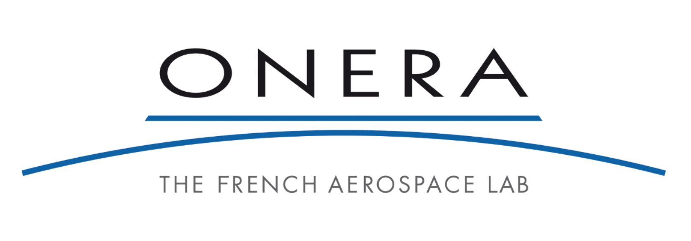

  

  <strong>MAGNOLIA</strong>

  <strong>Multi-rate Architecture for Guidance and Navigation, an Open-source Library Application</strong>

## 1. Overview

MAGNOLIA is an open-source flight control benchmark designed for the real-time computing and control systems research communities. 

Following the philosophy of the ROSACE (2014) multi-rate case study, MAGNOLIA scales up computational complexity to thoroughly challenge modern multi-core and embedded real-time processors. It implements a computationally intensive guidance and navigation pipeline for a 6-DOF Quadcopter.

---

## Table of Contents
* [2. Prerequisites & Dependencies](#3-prerequisites--dependencies)
* [3. Installation & Configuration](#4-installation--configuration)
* [4. Simulation & Verification Guide](#5-simulation--verification-guide)
* [5. Authors & Acknowledgments](#6-authors--acknowledgments)

---

## 2. Prerequisites & Dependencies

| Environment | Requirement
| :--- | :--- |
| **Standalone C Execution**| gcc or clang (with standard math support) |
| **Control / Simulation**| MATLAB / Simulink (R2025b) |
| **Verification Tools**| Python 3.12 (optionnal dependencies: matplotlib, numpy, pandas) |

---

## 3. Installation & Configuration

### Step 1: Clone the Repository
    git clone https://github.com/onera/magnolia.git

### Step 2: Synchronize MATLAB Targets to C
> **Important:** Before running the standalone C environment, you must export the synthesized control matrices and generated OSQP targets out of MATLAB.

1. Run `main_simu.m` in MATLAB to clean older targets and prepare variables.
2. Run `build_osqp_solver.m` to generate the custom sparse solver workspace folder (`osqp_c_code/`).
3. Invoke the export function:
    export_gains_to_c()
4. **Manual Swap:** Copy the newly built `osqp_c_code/` folder out of MATLAB and paste/replace the directory located at `c_implementation/lib/osqp_c_code/`.

---

## 4. Simulation & Verification Guide

### A. MATLAB / Simulink Pipeline
* Entry script: Run **`main_simu.m`**
* **Workflow:** Loads parameters ➔ Synthesizes LQI/Kalman/MPC matrices ➔ Compiles embedded OSQP MEX binaries ➔ Run batches (e.g., `StepX`) ➔ Saves `.csv` to `checker/` ➔ Automatically prompts the Python validation checker.

### B. Standalone C Execution & WCET Analysis
The discrete controller code can be evaluated locally using standalone loops and can be use to Worst-Case Execution Time (WCET) benching.

To compile and run the simulation suite natively:

    # Navigate to the target implementation tree
    cd c_implementation

    # Build the workspace including Mahony, and OSQP files
    gcc -ffp-contract=off -Wall -Iinclude -Ilib/osqp_c_code/include -Ilib/MahonyAHRS src/*.c lib/MahonyAHRS/MahonyAHRS.c debug/simu_WCET.c lib/osqp_c_code/src/osqp/*.c -lm -o build/simu_WCET 

    # Execute standalone scenario loops
    ./build/simu_WCET

> *Generates native telemetry logs (`c_StepX_hex.csv`) and timestamp data (`timing_StepX.csv`).*

### C. Automated Requirements Checker (Python)
The `checker.py` module natively ingests tracking outputs (handling floating-points and raw `%a` C-hex style entries) to validate performance bounds.

    from checker.checker import check_requirements, plot_simulation_results

    # Automated check (Settling Time, Rising Edge, Overshoot, RMSE thresholds)
    check_requirements("../checker/matlab_StepX.csv")

    # Generate analytical dashboard plots
    plot_simulation_results("../checker/matlab_StepX.csv")

### D. Bit-Accurate Consistency Verification
To evaluate differences (up to bit accurate using %a log) between Simulink and C environments, execute:

    python compare_c_to_matlab.py

* **Output:** Creates `log_delta.csv` evaluating step-by-step mathematical delta errors ($Value_{Simulink} - Value_{C}$).

---

## 5. Authors & Acknowledgments

* **Author:** Thomas Duroy (ONERA, ISAE-SUPAERO)
* **Supervisors:** Claire Pagetti (ONERA, ANITI) & Alex Dos Reis De Souza (ONERA)

### Institutional Support
This software framework is developed at **ONERA - The French Aerospace Lab** (Toulouse, France) and supported by **ANITI** (Artificial and Natural Intelligence Toulouse Institute).

  
  &nbsp;&nbsp;&nbsp;&nbsp;
  

